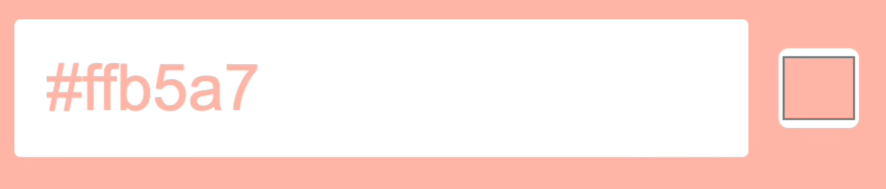
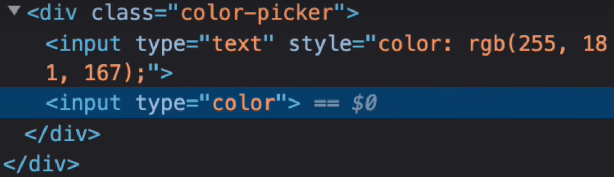
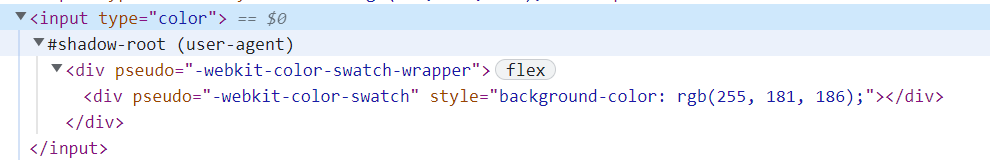
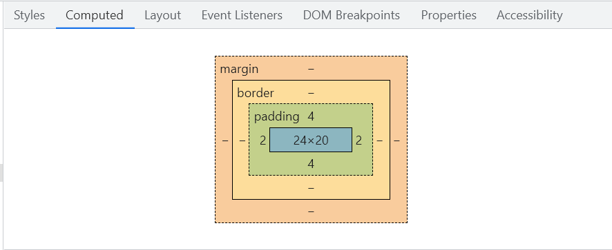
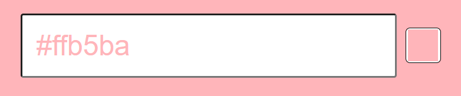

# 10color-selector

#### 场景



在CSS中给颜色选择器设置padding为0，仍存在白色边框，怎样将白色边框消除呢？查看input的节点的属性：



还是定位不了样式的问题。

#### 浏览器调试技巧

##### chrome内核

1. 打开devtools
2. 打开设置面板，在elements的部分勾选show user agent shadow dom

设置完成后再查看元素时就可以查看元素的内部结构了：



此时在Computed面板也可以看到颜色选择器有上下左右的padding：



通过设置-webkit-color-swatch-wrapper，消除padding，问题得到解决：

```css
input[type="color"]::-webkit-color-swatch-wrapper {
  padding: 0;
}
```



通过-webkit-color-swatch-wrapper可以设置其他细分样式，这里不再演示

##### firefox内核

通过上述方法设置的样式发现在firefox浏览器是不起作用的，这时需要兼容设置。

1. 打开about:config
2. 将devtools.inspector.showAllAnonymousContent设置为true

此时重新打开devtools就可以看到input的内部结构，进行css样式设置即可

#### 参考资料

视频链接：https://www.bilibili.com/video/BV1384y1z7JA
